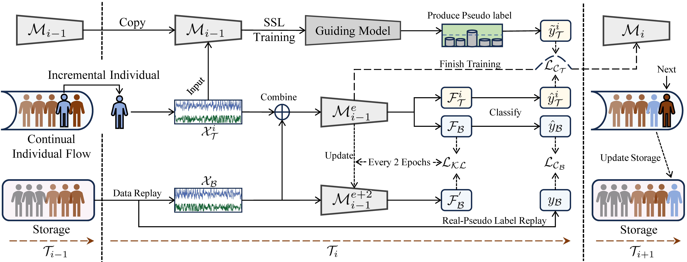
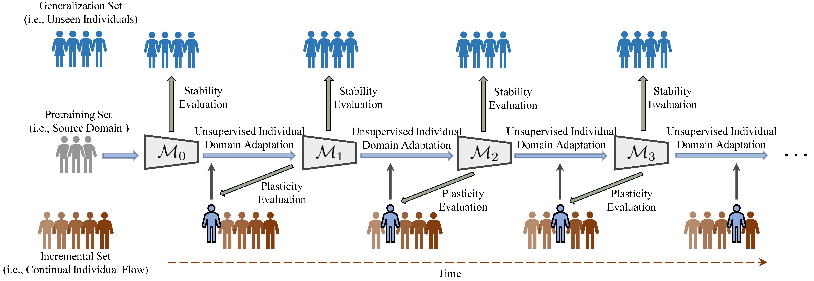

<div align="center">
  
# BrainUICL


_An Unsupervised Individual Continual Learning Framework for EEG Applications_
</div>
🔥 NEWS: This paper has been accepted by ICLR 2025

## Repository experiment map

The current SPR-EEG, PuriDivER-EEG, BrainUICL, and regularization CL-EEG migration lines are indexed in [EEG_CL_METHOD_MIGRATION_OVERVIEW_ZH.md](EEG_CL_METHOD_MIGRATION_OVERVIEW_ZH.md).

The clean full49 migration of the ICML 2026 T2T and robust-feature defenses is summarized in [experiments/icml2026_cl_defenses/full49/SUMMARY_ZH.md](experiments/icml2026_cl_defenses/full49/SUMMARY_ZH.md).

The shared attack entry point, defense assumptions, and initial BrainWash-vs-T2T probe are documented in [experiments/icml2026_cl_defenses/ATTACK_DEFENSE_DESIGN_ZH.md](experiments/icml2026_cl_defenses/ATTACK_DEFENSE_DESIGN_ZH.md).

## 🔍 About
We propose **BrainUICL**, a novel unsupervised individual continual learning framework, for continual EEG decoding on various clinical and BCI application.
The camera-ready version of the paper will be available at [Openreview](https://openreview.net/forum?id=6jjAYmppGQ&referrer=%5BAuthor%20Console%5D(%2Fgroup%3Fid%3DICLR.cc%2F2025%2FConference%2FAuthors%23your-submissions))
<div align="left">

</div>

## 🚢 Process
Our framework enables the pretrained EEG model to continuously adapt to multiple individual target domains one by one, absorbing new knowledge to improve itself, and ultimately becoming a universal expert for all unseen individuals. Specifically, the dataset is divided into three parts: pretraining(source domain), incremental(individual target domain) and generalization sets. We first pretrain the EEG model on the source domain. Then the incremental model needs to continuously adapt to each unseen individual one by one. The generalization set is used to evaluate the model’s stability after each round of incremental individual adaptation is completed. The detailed process of the UICL is as follows. 
<div align="center">

</div>

## 🚀 Start
The code we provide uses the ISRUC dataset as an example for demonstration. Specifically, all EEG signals are divided into 30-second segments, which are then categorized into five distinct sleep stages (Wake, N1, N2, N3, REM). We treat this task as a sequence-to-sequence classification problem, defining the sequence length as 20, which corresponds to one sleep sequence consisting of 20 30-seconds samples. **Before the continual learning process, you should set the parameter "is_pretrain" to _True_ to pre-train the EEG model first.**

```python
parser.add_argument('--is_pretrain', type=bool, default=True, help='pretraining')
```

## LoP diagnostics

`experiments/raeeg_lop_probe.py` is the BrainUICL-to-EdgeForge integration for
checkpoint-level Loss of Plasticity diagnostics. It does not change the
continual-learning trainer or checkpoint files. For each selected checkpoint
stage it measures the `fusion -> Transformer -> classifier_input` token
representations, effective/stable rank, CKA/Procrustes drift on one fixed
anchor subject, sampled Jacobian/NTK, gradients, activation statistics and
BrainUICL's head-normalized attention. It then runs a fixed-budget held-out
probe comparing the current checkpoint with the source-pretrained (or random)
fresh reference; `fresh_gap_final` is the primary LoP outcome.

The command below assumes the storage layout documented in
`REPRODUCTION_NOTES.md` and uses bounded calibration batches:

```bash
PYTHONPATH=. EDGEFORGE_SRC=/home/undefined/Desktop/EdgeForge/src \
/home/undefined/Disk/ai-storage/BrainUICL/envs/brainuicl/bin/python \
  experiments/raeeg_lop_probe.py \
  --dataset ISRUC \
  --data-root /home/undefined/Disk/ai-storage/BrainUICL/processed/isruc_group1_npy_float32 \
  --input-checkpoint-root /home/undefined/Disk/ai-storage/BrainUICL/model_parameter \
  --run-root experiments/regularization_cl_eeg_runs/clean49_bn_frozen_e10_lr1e6_seed4321 \
  --method finetune --stages 0,10,25 --fresh-reference random \
  --probe-steps 0,5,10,25,50 --batch 4 --num-worker 0 \
  --diagnostic-max-batches 4 --max-observations 256 \
  --jacobian-samples 2 --freeze-bn-stats \
  --output experiments/lop_diagnostics/brainuicl_isruc_seed4321.json
```

The command writes both the JSON payload and a same-name `.md` summary under
`experiments/lop_diagnostics/`. The JSON keeps all layer-level diagnostics;
the Markdown file is the compact stage table for review.

Use `--dataset FACED` with its 32-channel processed root to reuse the same
adapter. The default `--fresh-reference random` is the strict LoP probe: a
randomly initialized model gets the same target train/eval split and update
budget as the warm checkpoint. Use `--fresh-reference source` only for a
separate source-pretrained transfer baseline, and do not mix the two outcomes.
The probe labels are used only as an evaluation/oracle diagnostic;
they are not supplied to the unsupervised continual-learning update. Formal
LoP claims require the same split and budget across at least three seeds and
should report both `fresh_gap_final`/AULC and old-subject retention/BWT.
