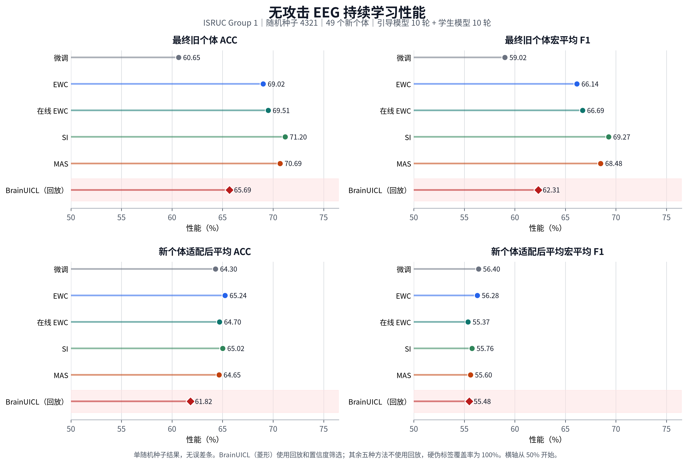

# EEG regularization-only continual learning: clean 49-subject results

## Protocol

- Dataset: ISRUC Group 1, using the existing BrainUICL split and subject order for seed 4321.
- Architecture and initialization: the original BrainUICL `FeatureExtractor`, `TransformerEncoder`, `SleepMLP`, and pretrained seed-4321 checkpoint.
- Stream: 49 new subjects, one subject per task.
- Guiding model: 10 epochs of CPC adaptation for each current subject.
- Student: 10 epochs of current-subject training with learning rate `1e-6` and batch size 16.
- Supervision: every guiding-model argmax prediction is used as a hard pseudo label. Coverage is exactly 100%; there is no confidence filtering.
- Memory: no replay buffer, DCB, or CEA. True current-subject labels are used only for evaluation and pseudo-label diagnostics.
- BatchNorm: the student's pretrained running mean and variance are frozen during continual learning. BatchNorm affine parameters remain trainable and are regularized like other parameters.
- Regularizers: EWC strength 5000; Online EWC strength 6500 with decay 1.0; SI strength `1.5e6` with `xi=1e-6`; MAS strength 3000 with decay 1.0.

The initial old-domain ACC/MF1 is 0.7025/0.6880. The initial pretrained model's mean ACC over all 49 stream subjects is 0.6464.

## Main results

| Method | Final old ACC | Final old MF1 | Old AAA | Final seen ACC | Final seen MF1 | BWT ACC | Mean current ACC gain | Mean pseudo-label ACC |
|---|---:|---:|---:|---:|---:|---:|---:|---:|
| Finetune | 0.6065 | 0.5902 | 0.6688 | 0.5489 | 0.4712 | -0.0941 | +0.0184 | 0.6541 |
| EWC | 0.6902 | 0.6614 | 0.6990 | 0.6285 | 0.5321 | -0.0240 | +0.0091 | 0.6533 |
| Online EWC | 0.6951 | 0.6669 | 0.7011 | 0.6367 | 0.5391 | -0.0103 | +0.0054 | 0.6526 |
| SI | **0.7120** | **0.6927** | **0.7133** | **0.6485** | **0.5556** | **-0.0017** | +0.0005 | 0.6551 |
| MAS | 0.7069 | 0.6848 | 0.7082 | 0.6432 | 0.5524 | -0.0034 | +0.0010 | 0.6548 |

SI gives the strongest stability in this run: its final old-domain ACC is 0.0095 above the initial checkpoint, its final seen-subject ACC is 0.0021 above the initial model's mean on those subjects, and its BWT is close to zero. MAS is second. EWC and Online EWC retain substantially more than Finetune while permitting slightly larger current-task updates than SI or MAS.

The stability result must not be interpreted as strong adaptation on every new subject. Mean current-task ACC gain falls from +0.0184 for Finetune to +0.0005 for SI. The guiding pseudo labels have mean ACC near 0.65 but range from about 0.23 to 0.89. With the required 100% coverage and no confidence filtering, strong regularizers often correctly resist low-quality pseudo-label updates, but they also suppress useful updates.

## Comparison with BrainUICL

| Method | Final old ACC | Final old MF1 | Mean new-subject ACC after adaptation | Mean new-subject MF1 after adaptation |
|---|---:|---:|---:|---:|
| Finetune | 0.6065 | 0.5902 | 0.6430 | 0.5640 |
| EWC | 0.6902 | 0.6614 | **0.6524** | 0.5628 |
| Online EWC | 0.6951 | 0.6669 | 0.6470 | 0.5537 |
| SI | **0.7120** | **0.6927** | 0.6502 | 0.5576 |
| MAS | 0.7069 | 0.6848 | 0.6465 | 0.5560 |
| BrainUICL | 0.6569 | 0.6231 | 0.6182 | 0.5548 |

These four metrics are directly available under the same ISRUC data, seed-4321 split, 49-subject order, and 10+10 epoch schedule. The two method families do not have the same resource assumptions: original BrainUICL uses a replay buffer and confidence-based pseudo-label selection, while the five methods above use no replay and accept all hard pseudo labels. The original BrainUICL run did not retain its final checkpoint or final per-subject re-evaluation, so its final-seen ACC/MF1 and BWT cannot be placed in the main table without rerunning it. The plotted values and protocol labels are also available in `regularization_vs_brainuicl_clean49.csv`.

## BatchNorm ablation

| Finetune setting | Final old ACC | Final old MF1 | Final seen ACC | Final seen MF1 | BWT ACC | Mean current ACC gain |
|---|---:|---:|---:|---:|---:|---:|
| BN running statistics updated | 0.5240 | 0.4616 | 0.4646 | 0.3548 | -0.1046 | +0.0719 |
| BN running statistics frozen | 0.6065 | 0.5902 | 0.5489 | 0.4712 | -0.0941 | +0.0184 |

The model contains eight BatchNorm layers. Parameter-only regularizers do not constrain their `running_mean` and `running_var` buffers. In the preliminary unfrozen-BN runs, old-domain ACC repeatedly collapsed when a new subject overwrote these statistics, even when the EWC penalty exceeded the pseudo-label loss. Freezing the student statistics removes this uncontrolled state change while leaving the guiding model free to adapt to the current subject.

## Artifacts and limitations

Each method directory contains `metrics.json`, `report.md`, and checkpoints at tasks 10, 25, and 49. `metrics.json` includes every subject's before/after metrics, pseudo-label diagnostics, old-domain curve, regularization losses, importance summaries, and final per-subject retention.

The regularization strengths were selected using exploratory results from the first six subjects of this same seed-4321 stream. The 49-task result is therefore a clean full-stream engineering validation, not an independent hyperparameter-blind benchmark. Before drawing publication-level statistical conclusions or tuning against PACOL/BrainWash, repeat the fixed configuration on independent subject orders and report mean and standard deviation. Attack parameters must be fixed without retuning the clean regularizers on attacked test results.
